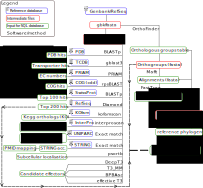

==================
Methods
==================

-----------
Overview
-----------

A simplified scheme of ``ChlamDB`` annotation workflow is shown in Figure 1. Briefely, 
annotated genome assemblies integrated into ChlamDB were downloaded from Genbank or 
RefSeq if the annotation was not available for the corresponding Genbank assembly.

    Figure 1: Simplified annotation workflow.

-------------------------------------------------------
Selection of PVC genomes to integrate into the database
-------------------------------------------------------

.. note::
    As of Sepetember 2019, they are `2,816` genome assemblies classified as part of 
    the PVC superphylum on the NCBI_taxonomy_website_ ()  

-------------------
Software versions
-------------------

.. table:: Version of the main softwares used for protein annotation
    :width: 800 px
    :align: center

    =============   =======
    Software name 	Version
    =============   =======
    FastTree 	    2.1.10
    Diamond      	0.9.24
    OrthoFinder  	2.2.7
    BLAST       	2.7.1
    CheckM      	1.0.12
    KoFamScan    	2019/4/9
    Mafft       	7.407
    =============   =======

-----------------
Source databases
-----------------

.. table:: Version of source databases used for the annotation
    :width: 800px
    :align: center

    ==================   ======================
    Database name 	     Version
    ==================   ======================
    UniprotKB-UNIPARC    2019.03
    TCDB 	             2019.06
    RefSeq               90
    CDD (COG)            v3.17
    InterProScan         5.35-74.0
    STRING               v11
    PDB                  2019.06
    COG/CDD              v3.17
    KoFam                2019.04.09
    PRIAM                2018.06
    ==================   ======================

------------------
Protein annotation
------------------

---------------
Homology search
---------------

----------------------------------
Type III secetion system effectors
----------------------------------

.. _NCBI_taxonomy_website: https://www.ncbi.nlm.nih.gov/Taxonomy/Browser/wwwtax.cgi?mode=Undef&id=1783257&lvl=3&p=gcassembly&lin=f&keep=1&srchmode=1&unlock