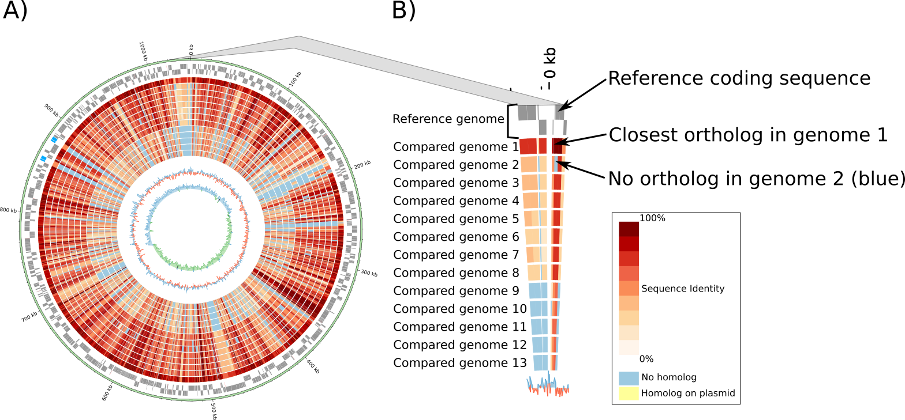

=======
Methods
=======

---------
Overview
---------

A simplified scheme of ``zDB`` annotation workflow is shown in **Figure 1**. In summary: 

    * Annotated genome assemblies integrated into ChlamDB were downloaded from GenBank_ (or 
      RefSeq_ if the GenBank assembly was not annotated).
    * Protein sequences were annotated based on data from multiple source databases and annotation softwares.
    * Protein sequences were clustered into orthologous groups (orthogroups) with OrthoFinder_. 
        * An alignment and a phylogeny was reconstructed for each orthologous group.
    * The closest homologs of each protein were identified in RefSeq_ and SwissProt_
        * A phylogeny including the closest non-PVC homologs was reconstructed for each orthogroup
    * Data were then integrated into a custom SQL database derived from the bioSQL_ relational model.

.. figure:: ../img/workflowV2.png
    :figclass: align-center

    **Figure 1**: Simplified annotation workflow.

-----------------
NextFlow pipeline
-----------------

The annotation pipeline summarized in **Figure 1** was fully automated using NextFlow_ . 
The code with detailed software versions and command line parameters is available on github here_.

-----------------------------------------------------
Selection of PVC genomes integrated into the database
-----------------------------------------------------

They are more than 2'000 genome assemblies classified as part of the PVC superphylum (NCBI Taxid 1783257)
on the `NCBI taxonomy website`_. Those genomes are highly redundant (with a high number of genomes of the
same species, in particular for species of the *Chlamydia* genus). In order to limit the size of the database,
not all genome assemblies were included into the database. 
``ChlamDB version 2.0`` (June 2019) includes:

    - All complete PVC genomes (June 2019).
    - All draft *Chlamydiae* genomes excluding draft genomes from species of
      the *Chlamydia* genus with at least one complete genome (June 2019).

.. note::
    Draft genomes of the most studied *Chlamydia* species were excluded because they are highly redundant

.. note::
    Draft genomes of *Planctomycetes*, *Lentisphaerae*, *Verrucomicrobia* and *Kiritimatiellaeota* phyla were 
    excluded to limit the total number of genomes in the database. Additional genomes of clades of interest
    might be integrated in future releases of the database.

The list of genomes is available on `ChlamDB home page`_. Complete genomes can be distinguished from draft 
genomes based on the number of contigs ("N. contigs" column) since draft assemblies exhibit more than one contig.

------------------
Protein annotation
------------------

Protein sequences were annotated using data from multiple databases and various bioinformatic softwares (*Figure 1*). 
Those annotations are summarized on the "locus" page available for each protein (see for instance the entry of CT_495_).

    * ``Transporters`` were annotated using the `Transporter Classification Database`_ (TCDB) and the gBLAST3 software from
      the `BioV suite`_. Detailed scores including the *E-value*, *score*, *percentage of identity*, the
      *number of transmembrane domains* identified in the query and the reference protein, the query and hit *coverage*
      are reported on the `locus page`_.
    * ``COG`` annotation was done with rpsblast_ (with an e-value cutoff of *0.001*) using `position-specific scoring matrix`_
      (PSSM) from the `Conserved Domain Database`_ (CDD)
    * Proteins were assigned to `Kegg Orthologs`_ (KO) numbers with KofamScan_ (default parameters) and KOfam_ (a database of Hidden Markov Models [HMM] of `KEGG Orthologs`_). KofamScan rely on HMMER_ to search the HMM database. 
        * The `KEGG API`_ was used to retrieve the annotation of ``Kegg Orthologs`` and mapping to ``KEGG modules``, ``KEGG pathways`` and `Enzyme Commission numbers`_.
    * `Enzyme Commission numbers`_ were assigned based on `Kegg Orthologs`_ annotations and with PRIAM_, a method for automated enzyme detection in fully sequenced genomes. PRIAM uses `position-specific scoring matrix`_ (PSSM) of all sequences available in the ENZYME_ database.
    * InterProScan_ was used to identify protein signatures such as ``transmembrane domains``, ``Pfam domains``, ``CDD domains``,... Detailed InterPro annotations as well as scores associated with each annotation are reported on the "InterproScan" tab of each `locus page`_.
        * `The InterProScan match lookup service`_ was used to retrieve pre-calculated InterProScan results for protein integrated into the InterPro database. For sequences not in the lookup service, InterProScan was used to analyse sequences from scratch.
    * Mapping to STRING_ (a database of protein-protein interactions) was done by exact protein sequence match. 
      Protein sequences from SRING were indexed using `SEGUID checksums`_. Associations to the scientific literature (``PMID`` tab visible `only if references were found`_) 
      were retrived using the `STRING API`_.  
    * Protein subcellular localization predictions were done using PSORTb_ (withe the ``--negative`` argument). 
    * Effectors of the type III secretion system were predicted using four different softwares:
        * BPBAac_ (default parameters)
        * effectiveT3_ (model ``TTSS_STD-2.0.2``, cutoff of ``0.9999``)
        * DeepT3_  (default parameters)
        * T3_MM_ (default parameters)
    * TODO: UNIPARC - SwissProt

-----------------------------------------
_`Homology search` (RefSeq and SwissProt)
-----------------------------------------

* The closest identifiable RefSeq_ homologs were searched with Diamond_ (parameters: ``--max-target-seqs`` 200 ``-e`` 0.01 ``--max-hsps`` 1). The 200 first hits were retained for each protein.

* The closest identifiable SwissProt_ homologs were searched with BLASTp (parameters: ``-evalue`` 0.001). The 100 first hits were retained for each protein.

--------------------------------
_`Identification of Orthogroups`
--------------------------------

Orthogroups (or orthologous groups) were identified with OrthoFinder_. This tools identify orthogroups based on BLASTp (parameters: ``-evalue`` 0.001) 
results using the MCL_ clustering software.

.. note::
   ``Orthologs`` are pairs of genes that descended from a single gene in the last common ancestor (LCA) of two species.

.. note::
    An ``orthogroup`` is the group of genes descended from a single gene in the last common ancestor (LCA) of a group of species.
    As gene duplication and loss occur frequently in bacteria, we rarely have exactly one ortholog in each considered genome.

--------------------------------------------------------
Orthogroup multiple sequence alignments & phylogenies
--------------------------------------------------------

Protein sequences of each orthogroup were aligned with MAFFT_ (default parameters). A phylogeny was then reconstructed for each orthogroup of three or more sequences. The phylogeny was reconstructed with FastTree_ with default parameters. The node support values are not traditionnal `boostrap support values`_. FastTree_ uses the Shimodaira-Hasegawa test with 1,000 bootstrap replicates to quickly estimate the reliability of each split in the tree. Values higher than **0.95** can be considered as "strongly supported".

---------------------------------------
Phlogeny including top RefSeq hits
---------------------------------------

A second phylogeny was reconstructed for each orthogroup. This phylogeny includes the 4 best  non-PVC RefSeq hits of each protein (see the `Homology search`_ paragraph). 
First, the NCBI taxon ID of each RefSeq hit was retrieved using the ``prot.accession2taxid`` mapping file available from the `NCBI taxonomy ftp website`_. PVC hits were removed and the amino acid sequence of the 4 best non-PVC hits was retrieved from the NCBI using the `biopython interface to Entrez`_. Protein sequences of each orthogroup + RefSeq homologs were aligned with MAFFT_ (default parameters) and the phylogeny was reconstructed with FastTree_ (default parameters).

\

This phylogeny allows users to check whether PVC proteins form a monophyletic group or if they are for instance hints of horizontal gene transfer(s) with bacteria from other phyla.

----------------------------------------
Calculation of pairwise protein identity
----------------------------------------

Pairwise protein sequence identities reported on ChlamDB were calculated based on the multiple sequence alignments of orthologous groups (two see previous paragraph). The identity between two sequences can be calculated in different ways (see `this blog post discussing`_ that topic). We calculated the identity by excluding gaps and calculating the identity based on aligned positions only: 

* number of matches / ( number of matches +  number of mismatches)

Nevertheless, if the alignment covered less than 30% of one of the two compared sequences, the identity was set to 0.

------------------------------
Circular genome plots (Circos)
------------------------------

Circular genome plots are generated dynamically with Circos_. These plots are not generated based on the alignment of DNA sequences but based on orthology data (see previous paragraphs). The two outer gray circles show the location of `open reading frames`_ (ORFs) encoded on the leading and lagging strand of the reference genome (**Figure 2 A and B**). The red/blue inner circles show the conservation of each protein encoding ORF in one or multiple other genomes. Identity values were pre-calculated from protein alignments (see previous paragraphs). If the compared genomes encode more than one ortholog, the highest identity is used to color the region.

    **Figure 2**: Example of circular genome plot. **A)** Compared genomes are ordered based on the median protein identity with the reference genome. **B)** Zoom showing the detail of a genomic region. All circular plots are interactive and users can click on any ORF to access the detailed annotation page of the corresponding protein.

------------------
Species phylogeny
------------------

The reference phylogeny was reconstructed with FastTree_ (default parameters, JTT+CAT model) based on the concatenated alignment of 32 single copy orthogroups conserved in at least 266 out of the 277 
genomes part of ``ChlamDB 2.0``.

------------------------------------------
Prediction of protein-protein interactions
------------------------------------------

The interactions reported in the "interactions" tab were predicted based on two different approaches: ``phylogenetic profiling`` and ``conservation of gene neighborhood``. Indeed, proteins that physically interact tend to be encoded in a close neighborhood and tend to co-occur in the same genomes (see `Dandekar  et al`_ and `Kensche et al.`_ for more details).

+++++++++++++++++++++++++
1 Phylogenetic profiling
+++++++++++++++++++++++++

Orthogroup exhibiting similar patterns of presence/absence were identified by calculating the euclidian and jaccard distances of all pairs of orthologroups phylogenetic profiles (see **Figure 3**). See `Kensche et al.`_ for a review on phylogenetic profiling methods.

    1. Phylogenetic profiles were collapsed at the species level. If an orthogroup was present in only a subset of the strains of the considered species, it was still considered as present in that species.
    2. Pairwise euclidean_ and jaccard_ distances were calculated between pairs of profiles
    3. The default euclidian distance cutoff to report interactions is ``2.2``. If more than 30 profiles had an euclidian distance smaller or equal to ``2.2``, the stringency was adjusted incrementally with cutoffs of ``2``, ``1`` and finally ``0``. If more than 30 profiles exhibit the exact same profile, nothing is reported. Indeed, it would by typically poorly informative profiles (e.g. proteins conserved in all species).

    **Figure 3**: Schematic view of the phylogenetic profiling method used to predict protein-protein interactions. Distances between profiles of presence/absence of orthologs were calculated using two different metrics (euclidean_ and jaccard_ distances). 

.. note::
    Have a look at the predicted interactors of the `cell shape-determining protein MreB`_. The detailed profile of each orthogroup is available in the "profile" tab.

.. warning:: 
    The profiles 5 and 6 in **Figure 3** are strictly identitcal but poorly informative since orthologs were identified in all considered species. Spurious associations like this one cannot always be automatically discarded. Thus, those associations should always be interpreted with caution. The detailed profile of associated orthogroups is always provided ("profile" tab).

+++++++++++++++++++++++++++++++++++++++++++++++++++++++++++++++++++++
2. Identification of conserved gene neighborhood in different species
+++++++++++++++++++++++++++++++++++++++++++++++++++++++++++++++++++++

Genes encoded in a close neighborhood in distantly related species were identified based on orthology data (see `Identification of Orthogroups`_). See for example the case of the subunits of the `F-type ATPase`_ that are systematically encoded in a close neighborhood. The method was the following:

    1. protein encoding genes were iterated for each genome 
    2. if the considered protein encoding gene had one (or multiple) homolog(s) in distantly related genomes (a cutoff of 60% median protein identity was used to consider two genomes sufficently distant)
    3. the 10 kilobases upstream and downstream of each ortholog were compared to the reference genome to identify conserved  neighbors (see **Figure 4.A**)
    4. the ratio of co-occurence of pairs of orthogroups was used to score the association between pairs of locus (**Figure 4.B**) 
    5. only proteins exhibiting a ``conservation score of 0.8`` are reported in the "interactions" tab of locus pages

.. figure:: ../img/conserved_neig.svg
    :figclass: align-center
    :width: 100 %

    **Figure 4**: Identification of conserved gene neighborhood. **A)** Example with the red locus, part of the orthologous group ``group_222``. This locus has orthologs in 3 other genomes. 
    Proteins encoded 10 kilobases upstream and 10 kilobases downstream of the reference locus are extracted and compared between the reference 
    genome and all other genomes in which an ortholog is present. **B)** The ``conservation score`` of a pair of locus is the ratio of cases for which orthologs were encoded in the green windows out of the total number of comparisons. For instance, the green locus is encoded less than 10kb upstream of the red locus in two genomes, but more than 10kb appart in the third genome. Is score is thus of 2/3 (2 out of 2 comparsions). The pink locus is always encoded in the vicinity of the red locus in all compared genomes. Its score is thus of 3/3. **C)** If multiple orthologs were identified if the compared genome, only the most similar one is considered for the comparison (based on amino acid identity calculated based on the orthogroup multiple sequence alignment). 

.. warning::
    Since orthologous groups identified by OrthoFinder_ include both orthologs and paralogs, the relationship between pair of genomes is not necessarily 1 to 1 (have a look at the `OMA website`_ to read detailed explanations of the different types of orthologs). If multiple orthologs were encoded in the compared genome, only the most similar one was used for the comparison (**Figure 4.C**). The choice of the closest locus was based on protein identity and not based on phylogenetic trees, which means that we might not always consider the most closely related protein encoded in the compared genome for the comparison.

-----------------------------------------------------------
Prediction of candidate type III secretion system effectors
-----------------------------------------------------------

Effectors of the type III secretion system are poorly conserved. In addition, the signal allowing to specifically secrete effector proteins is not clearly identified. It is thus difficult to identify effectors in newly sequenced genomes. Predition methods generally rely on the use classifiers that are trained on a set of known effector proteins. Since all *Chlamydiae* genomes encode a type III secretion system, candidate effectors were identified using four different classifiers:

    * BPBAac_ (default parameters)
    * effectiveT3_ (model ``TTSS_STD-2.0.2``, cutoff of ``0.9999``)
    * DeepT3_  (default parameters)
    * T3_MM_ (default parameters)

Results of all four tools are reported on the `locus page`_  of each protein (in the ``T3SS effectors prediction`` section).

------------------------------------------
Taxonomic profile of Pfam domains and COGs
------------------------------------------

Coding sequences of the 6661 reference and representative genomes available from RefSeq (September 2017) were downloaded from RefSeq ftp (ftp://ftp.ncbi.nlm.nih.gov/refseq/). 
Hidden Markov models of the PFAM database were used to search for sporulation-related domains using hmmsearch (HMMER version 3.1b2). 
Hits were filtered based on PFAM trusted cutoffs. Genomes were then grouped by order based on the NCBI Taxonomy database with the python library ete3. 
Only orders exhibiting a minimum of 5 genomes are reported of the figure.

* see for instance the profile of the Pfam domain PF01823 (MAC/Perforin domain): https://chlamdb.ch/pfam_profile/PF01823/phylum

.. figure:: ../img/PF08486_phylum_profile.svg
    :figclass: align-center
    :width: 600 px

Phylogenetic profiles of COGs are based on data from the eggnog_ database (v4.51). Eggnog provides Clusters of Orthologous Groups annotation of 2,031 genomes. 
Taxonomic profiles of non-supervised orthologous groups (NOGs) were extracted from the file  `NOG.members.tsv`_ . 
The 2,031 genomes were classified according to the classification of the NCBI taxonomy database.

* see for instance the profile of COG2385 (Peptidoglycan hydrolase enhancer domain protein): https://chlamdb.ch/eggnog_profile/COG2385/phylum

-----------------------------------------------------------
Evaluation of the quality and completeness of draft genomes
-----------------------------------------------------------

The completeness and contamination of each genome was evaluated with checkM_ (v1.0.12). Completeness and contamination estimates are reported on the the `home page phylogeny`_. 

-----------------
Pubmed References
-----------------

Links to Pubmed references were retreived from two difference sources: STRING_ (v11)  and PaperBLAST_ (September 25 2019_release). 

- STRING_ references are derived from text mining of scientific publications. Only PubMed references from identical protein sequences were retrieved from STRING_.
- PaperBLAST_ links to research publications come from automated text searches against the articles in EuropePMC and from manually-curated information from GeneRIF, UniProtKB/Swiss-Prot, BRENDA, CAZy (as made available by dbCAN), CharProtDB, MetaCyc, EcoCyc, REBASE, and the Fitness Browser (see `PaperBLAST paper`_). All proteins were blasted against the PaperBLAST database (evalue cutoff of 10^-3). Links to research publications from the top 20 best hits were integrated into ChlamDB.

---------------------------
Protein accessions mapping
---------------------------

Protein accessions from multiple reference databases such as **RefSeq**, **GenBank** and **UniProt** can be used to search for ChlamDB entries. The mapping between the various identifiers was donc 

* by exact protein sequence match for **UniParc/UniProt**
* was extracted from RefSeq genome assembly records for **RefSeq**. The "old_locus_tag" qualifier was used to map RefSeq locus tags with Genbank locus tags (see `RefSeq documentation`_)

------------------------------
SQL database and Web Interface
------------------------------

TODO
* database size 80Gb
* Figure generated from stores data

.. note::
    Thee SQL database is about 80GB in size. Protein alignments are not stored into the database.

-----------------
Source databases
-----------------

.. table:: Version of source databases used for the annotation
    :width: 800px
    :align: center

    ==================   ======================
    Database name 	     Version
    ==================   ======================
    UniprotKB-UNIPARC    2019.03
    TCDB 	             2019.06
    RefSeq               90
    CDD (COG)            v3.17
    InterProScan         5.35-74.0
    STRING               v11
    PDB                  2019.06
    COG/CDD              v3.17
    KoFam                2019.04.09
    PRIAM                2018.06
    EggNOG               4.51
    ==================   ======================

-------------------
Software versions
-------------------

.. table:: Version of the main softwares used for protein annotation
    :width: 800 px
    :align: center

    =============   =======
    Software name 	Version
    =============   =======
    FastTree 	    2.1.10
    Diamond      	0.9.24
    OrthoFinder  	2.2.7
    BLAST       	2.7.1
    CheckM      	1.0.12
    KoFamScan    	2019/4/9
    Mafft       	7.407
    PSORTb          3.0.6
    HMMER           3.1b2
    =============   =======

-----------------
Code availability
-----------------

=====================================   ===========================================================
Website interface                       https://github.com/metagenlab/chlamdb
Annotation pipeline                     https://github.com/metagenlab/annotation_pipeline_nextflow
Public database download and indexing   https://github.com/metagenlab/databases_setup
=====================================   ===========================================================

.. _`NCBI taxonomy website`: https://www.ncbi.nlm.nih.gov/Taxonomy/Browser/wwwtax.cgi?mode=Undef&id=1783257&lvl=3&p=gcassembly&lin=f&keep=1&srchmode=1&unlock
.. _GenBank: https://www.ncbi.nlm.nih.gov/genbank/
.. _RefSeq: https://www.ncbi.nlm.nih.gov/refseq/
.. _OrthoFinder: https://github.com/davidemms/OrthoFinder
.. _MCL: https://micans.org/mcl/
.. _NextFlow: https://www.nextflow.io/
.. _here: https://github.com/metagenlab/annotation_pipeline_nextflow/blob/master/annotation_pipeline.nf
.. _`ChlamDB home page`: https://chlamdb.ch/#genomes
.. _SwissProt: https://www.uniprot.org/
.. _CT_495 : https://chlamdb.ch/locusx?accession=CT_495
.. _`Transporter Classification Database` : http://www.tcdb.org/
.. _`BioV suite` : https://github.com/SaierLaboratory/BioVx
.. _`Conserved Domain Database` : https://www.ncbi.nlm.nih.gov/Structure/cdd/cdd.shtml
.. _`position-specific scoring matrix` : https://www.ncbi.nlm.nih.gov/Structure/cdd/cdd_help.shtml#CD_PSSM
.. _rpsblast : https://www.ncbi.nlm.nih.gov/books/NBK279690/
.. _`Kegg Orthologs`: https://www.genome.jp/kegg/ko.html
.. _KOfam : https://www.genome.jp/tools/kofamkoala/
.. _`KEGG API` : https://www.kegg.jp/kegg/rest/keggapi.html
.. _bioSQL : https://biosql.org/wiki/Main_Page
.. _`locus page` : https://chlamdb.ch/locusx?accession=CT_495
.. _InterProScan : https://github.com/ebi-pf-team/interproscan
.. _`The InterProScan match lookup service` : https://github.com/ebi-pf-team/interproscan/wiki/LocalLookupService
.. _`Enzyme Commission numbers` : https://www.qmul.ac.uk/sbcs/iubmb/enzyme/
.. _PRIAM : http://priam.prabi.fr/
.. _STRING : https://www.string-db.org/
.. _`SEGUID checksums` : https://biopython.org/DIST/docs/api/Bio.SeqUtils.CheckSum-module.html
.. _PSORTb : https://www.psort.org/psortb/index.html
.. _BPBAac : https://academic.oup.com/bioinformatics/article/27/6/777/235789
.. _T3_MM : https://journals.plos.org/plosone/article?id=10.1371/journal.pone.0058173
.. _effectiveT3 : https://academic.oup.com/nar/article/39/suppl_1/D591/2507337
.. _DeepT3 : https://academic.oup.com/bioinformatics/article/35/12/2051/5165378
.. _`STRING API` : http://version11.string-db.org/help/api/
.. _HMMER : http://hmmer.org/
.. _KofamScan : ftp://ftp.genome.jp/pub/tools/kofamscan/
.. _ENZYME : https://enzyme.expasy.org/
.. _Diamond : https://www.nature.com/articles/nmeth.3176
.. _MAFFT : https://mafft.cbrc.jp/alignment/software/
.. _FastTree : http://www.microbesonline.org/fasttree/
.. _`boostrap support values` : https://onlinelibrary.wiley.com/doi/abs/10.1111/j.1558-5646.1985.tb00420.x
.. _`this blog post discussing` : http://lh3.github.io/2018/11/25/on-the-definition-of-sequence-identity
.. _Circos : http://circos.ca/
.. _`only if references were found` : https://chlamdb.ch/locusx?accession=765098
.. _`open reading frames` : https://en.wikipedia.org/wiki/Open_reading_frame
.. _`Kensche et al.` : https://royalsocietypublishing.org/doi/10.1098/rsif.2007.1047
.. _Euclidean : https://en.wikipedia.org/wiki/Euclidean_distance
.. _jaccard : https://en.wikipedia.org/wiki/Jaccard_index
.. _`NCBI taxonomy ftp website` : ftp://ftp.ncbi.nih.gov/pub/taxonomy/accession2taxid/
.. _`biopython interface to Entrez` : https://biopython.org/DIST/docs/api/Bio.Entrez-module.html
.. _`cell shape-determining protein MreB` : https://chlamdb.ch/profile_interactions/group_414
.. _`Dandekar  et al` : https://www.ncbi.nlm.nih.gov/pubmed/9787636
.. _`OMA website`: https://omabrowser.org/oma/type/
.. _`F-type ATPase` : https://www.chlamdb.ch/neig_interactions/wcw_1123
.. _PaperBLAST : http://papers.genomics.lbl.gov/cgi-bin/litSearch.cgi
.. _`PaperBLAST paper` : https://www.ncbi.nlm.nih.gov/pubmed/28845458
.. _`home page phylogeny` : https://chlamdb.ch/#phylogeny
.. _checkM : https://ecogenomics.github.io/CheckM/
.. _eggnog : http://eggnogdb.embl.de/#/app/home
.. _`NOG.members.tsv`: http://eggnogdb.embl.de/download/eggnog_4.5/data/NOG/
.. _`RefSeq documentation` : https://www.ncbi.nlm.nih.gov/refseq/about/prokaryotes/reannotation/
