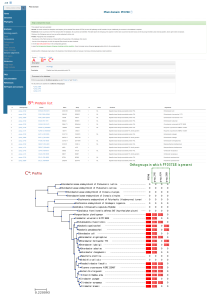

================
Website tutorial
================

.. warning:: 
    This page is under construction. Contact Trestan Pillonel (trestan.pillonel@chuv.ch) if you have any question or suggestion regarding the website or its documentation.

This page attempts to provide the user with help to understand and perform the analyses offered in the webinterface.

In this tutorial a database composed of a collection of *Enterobacteriaceae* genomes is presented and a focus on the fliLMNOPQR operon and specifically on FliL is reserved to display the available analyses. This operon is FlhDC-dependent and encodes important regulatory factors and structural components of the membrane-spanning basal body of the flagellum.

--------------------------------
HOME page
--------------------------------
In the HOME page the user has an overview of the genomes included in the database through the 'Genome' and 'Phylogeneny' sections (see the paragraph below) and the status of the database. Indeed, a summary reports which analyses are available, and which have not been included in the generation of the database.
Note that it is necessary to re-run the pipeline to incude the new analyses if wished (-resume argument - see documentation)
| Direct access to the available analyses is provided in:
    * the home page
    * the left menu to facilitate the navigation

--------------------------------
Genome table and phylogeny
--------------------------------
Through the genome table the user can move the first steps to globally evaluate the content of the database, getting details about the contigs and the loci identified on each genome (the clickable locus tags redirect to the ``Protein annotation view`` page).
The phylogeny, built on concatenated single copy orthologs with FastTree, shows the evolutionary relationships between the genomes given in input and essential data for the quality assessment of the given sequences.

--------------------------------
Homology search - Blast
--------------------------------
Perform a blast search of one or more sequences of interest against one or more genomes of the database.
| Either an amino-acid or a nucleotide sequence can be given as input.

Set up:
    * the type of homology search according to the input file:
         - blastp, tblastn with an aa sequence
         - blast_ffn, blast_fna, blastx with a nt sequence
    * e-value
    * maximum number of hits to display
    * target genome or all genomes

*Note*: If the search is performed against all genomes, max number of hits should be set up to 'all' to avoid losing high identity matching hits. 

In the reported example the protein sequence of the genes of fliLMNOPQR operon extracted from *Enterobacter soli* genome are blasted (blastp) against all genomes of the database (**Fig.1**).

.. figure:: ../img/blastp_search.svg
    :figclass: align-center
    :width: 100%

    **Figure 1:** Blast interface for homology search. Blastp of fliLMNOPQR operon genes (target: all, max number of hits: all). In 'blast input' box amminoacid sequences of all genes introduced by a header.

Through this analysis it is possible to identify whether any of these genes is present in the genomes and evaluate the number and the identity of the alignment of each hit (**Fig.2 - Result 1**):

| **A**. visual identification of hits for fliL gene
| **B**. info table about the hits (genome, contig/locus_tag, alignment scores and identity - Note that the locus tags are clickable and linked to the ``Protein annotation view``),
| **C**. Alignment of the query and the sequence of a hit selected in table B.

| Additionally, the generated annotated phylogeny facilitate the interpretation of their distribution and conservation along all the genomes. As shown in **Fig.2 - Result 2**, four genomes carry all the investigated genes, fourteen genomes do not carry them, while the remaining ones have an incomplete set. 

 

.. figure:: ../img/blastp_result2.svg
    :figclass: align-center
    :width: 100%

    **Figure 2: Blastp results** . *Result 1*: Details and *Result 2*: Phylogenetic distribution. 

**TIPS**:

- If you are interest in a specific gene expected to be present in one of the genomes included in the database, you can either retrive the sequence in a public database, such as SwissProt, or use the search bar in the left-side menu of the web interface. Type the gene name, and identify which loci are annotated with that gene, clicking on one of them the user can directly retrieve both the nucleotide and the amino acid sequence of the gene - see ``Protein annotation view`` page below.
- Compare the genomic regions around a protein of interest in selected genomes accessing the 'MENU/Genome alignments/Plot region' analysis - see ``Genome alignments`` page below.

--------------------------------
Comparisons
--------------------------------
This block of analyses can widely change based on the settings defined during the generation of the database - see the *documentation* for an extensive explanation.
It allows the user to compare several aspects of selected genomes and perform comparative analyses for each annotation: a) Orthogroups are identified by default, and differently, the user can optionally identify b) KEGG orthologs, c) COG cluster, and d) PFAM domains along the genomes during the database generation.

Before proceeding here a brief summary of the mentioned annotations and the link to their databases:
    * **Kegg**: Kegg annotations refer to the Kyoto Encyclopedia of Genes and Genomes (KEGG_). The genome annotation is composed of two aspects: a) KO assignemnt (KO is the identifier given to a functional ortholog defined from experimentally characterized genes and protein in specific organism), b) KEGG mapping where each KO is stored in a PATHWAY or MODULE identified based on molecular networks. This database provides a highly curated and repliable description of the metabolic pathway of the annotated genomes.
    * **COG**: COG annotations refer to the database of Cluster of Orthologous Genes (COGs_). In this database each COG is assigned to a functional category including metabolic, signal transduction,repair and other pathways. This database allows an easy comparison of organisms based on their preference for certain pathways.
    * **Pfam**: Pfam annotations refer to the Pfam_ database used to identify protein families and domains. Due to the nature of proteins as combinations of fixed structure, this database is based on the idea that the identification of domains wihin proteins can provide insights to discover their function.

| The following example in **Fig. 3 refers to the Orthogroups analyses**, however the same outputs are generated also when KEGG, COG and PFAM domain are considered (check the help paragraph entitled '*Additional plots for Kegg Orthologs and Cluster of Orthologous Groups (COGs)*' to discover the extra outputs generated with some of these annotations).

**Overview of Orthogroups analyses**

Orthogroups are identified with Orthofinder_, an accurate platform that cluster *set of genes that are descended from a single gene in the last common ancestor of all the species being considered* as reported in its publication_.
In the following example, the orthogroup content is compared between *Enterobacter soli, Enterobacter ausbriae, Enterobacter ludvigii, and Klebsiella variicola* genomes. 

List of analyses:

| **1. Detailed comparison**: identify those orthogroups uniformly present in a set of genomes of interest and, optionally absent in others. Flexibility can be given to include orthogroups that, although present in some of the selected genomes, are not uniformly present in all and are missing in some ('Missing data' parameter).

    * **1A.** Summary of the selected settings for the comparative analysis: the orthgroup of 4 genomes are compared, no orthogroup will be exclused if present in other genomes, orthogroup that are present in 3 out of the 4 selected genomes are also reported.
    * **1B.** List of identified orthogroups, description and distribution in the selected genomes: clicking on a Orthogroup entry redirects the user to the *Orthogroup annotation summary* page.
    * **1C.** List of locus tags per each orthogroup and genome: clicking on a Orthogroup entry redirects the user to the ``Protein annotation view`` page.

.. figure:: ../img/OverviewOrt_r1_r2.svg
    :figclass: align-center

    **Figure 3:** Orthogroups comparison overview of *Enterobacter soli, Enterobacter ausbriae, Enterobacter ludvigii, and Klebsiella variicola*. Analysis 2, 3, and 4 are reported in Fig. 4; analysis 5 is reported in Fig. 5.

In **Fig. 4**: 

| **2. Venn diagram**: select a maximum of 6 genomes to visualize the distribution of their Orthogroups. This representation simplifies the identification of similarity/dissimilarity of Orthogroups between a few genomes.
| **3. Compare Orthogroup size**: Visualize the number of entries of each Orthogroup in common between a selected set of genomes. This representation higlights which orthogroups are enriched or poorly represented in the genomes of interest.
| **4. Whole proteome heatmaps**: Heatmap of presence/absence of the pool of Orthogroups present in the selected genomes. Discover which Orthogroups are widely shared by a subset of interest and which genome differentiate from the others. Going over the plot with the mouse it displays the orthogroup name, the organism of interest and the nummber of hits associated to that Orthogroup.

.. figure:: ../img/Ort_venSize_heat.svg
    :figclass: align-center

    **Figure 4.** Orhogroup comparison analyses of *Enterobacter soli, Enterobacter ausbriae, Enterobacter ludvigii, and Klebsiella variicola*.

| **5.Pan/Core genome plot**: Graphical representation of the pan- and core- genome of a subset of genomes or of the uploaded dataset (**Fig. 5**).
This analysis generates three plots that display the content and conservation of Orthologous groups in selected genomes of interest.

    * **A**: this plot shows the number of all Orthologous groups present in a set of genomes. If the green curve reaches a plateau we can talk about 'closed pangenome' since no new Orthogroups are carried by additional genomes, on the contrary if the increment of the curve grows when looking at other genomes we can talk about 'open pangenome'.
    * **B**: The red curve represents the core Orthogroups shared by the genomes and it tends to decrease as much as the compared genomes are different.
    * **C**: the blue curve represents the number of Orthologous groups present in exactly n genomes displayed in the x-axis. This representation is useful to appreciate how many Orthologous groups are present in the totality of the genomes of interest, for example, or the diversity brought by single genomes. For example, if tot-1 is low it means that there are no specific genomes that bring a unique Orthologous groups.

.. figure:: ../img/Core_pan_Ort_three.svg
    :figclass: align-center

    **Figure 5.** Accumulation/rarefaction plots.

Additional plots for Kegg Orthologs and Cluster of Orthologous Groups (COGs)
=============

As anticipated, the comparative analyses of Kegg and COGs come with additional plots:

**1. Barchart of the distribution of the entries annotated with a COG/KEGG category of selected genomes**. It allows the evaluation of potential increment or descrement of entries known to be relevant for a certain function in some genomes of interest (**Fig. 6**).

Here a focus on the COG 'Cell motility' category is rereserved. *Klebsiella variicola* shows fewer entries annotated in the 'Cell mobility' COG category than *Enterobacter soli, Enterobacter ausbriae*, and *Enterobacter ludvigii*.

.. figure:: ../img/COGs_overview_bar_o.svg
    :figclass: align-center

    **Figure 6.** COGs comparison page. Barchart for each COG category representing the number of entries identified in each genome. The 'Cell motility' category is highligthed in green to stress the differences between the four selected genomes. Analysis 2 and 3 are reported in Fig. 7.

**2 and 3. Heatmaps of the COGs along all the genomes expressed as fequency or number of identified entries ** (These plots are available only for COGs)
| Here the focus is again on the COG 'Cell motility' category where it emerges that *Klebsiella variicola* has 67 loci annotated in this category that represents 1.29% of total number of its loci, while *Enterobacter soli* has more than the double of its loci annotated in this category, 2.76% of them.

.. figure:: ../img/COGs_heatmaps_o.svg
    :figclass: align-center

    **Figure 7.** Heatmaps of presence/absence of entries annotated with each COG category expressed as counts (2) or as frequencies (3). In the green box, the 'Cell motility' category, in purple, the two genomes of interest.

--------------------------------
Genome alignments
--------------------------------
This set of analyses allow the user to align the genomes and check the conservation of specific regions of interest.
| Two plots can be generated:
    * circos
    * Plot region

Circos
=============
Genomes alignment visualized in an interactive circular layout. This plot can trigger the identification of differentially distributed genomic regions in the genomes of interest, the presence of potential plasmid(s), or the products of other HGT events when looking at the GC composition, for example.
Following the help box, it is possible to recognize which regions encode for genes or tRNA and evaluate the conservation of the sequence checking the identity percentages.

In **Fig. 8 B**, *Enterobacter ausbriae, Enterobacter ludvigii, and Klebsiella variicola* are mapped against 'Enterobacter soli'. The genomes appears similar in terms of gene content, however *Enterobacter soli* carries a plasmid which is absent in the other genomes.
When the user clicks on a gene of interest the ``Protein annotation view`` page will be displayed and provide the user with all the information about function, distribution and conservation of this protein. 

**NOTE**: the regions present in one of the compared genomes but in the reference, will not be visualized. A new plot inverting the genome given as reference will give this info.

Plot region
=============
'Plot region' analysis allows the user to discover a specific genomic region of interest. It plots the genomic features located in the neighborhood of a provided target locus, it displays the conservation of the protein of interest and the genes present in the flanking region among selected genomes (max 20000 bp).

In **Fig. 8 B**, the focus is on the fliL gene of the fliLMNOPQR operon in *Enterobacter soli, Enterobacter ausbriae, Enterobacter ludvigii, and Klebsiella variicola*.
The operon is highly conserved in the Enterobacter genomes, but absent in *Klebsiella variicola*, which is indeed not reported in the plot (Fig. 8 B). (Note that the phylogeny obtained in *Homology search - Blast*, already highlight the lack of these genes in *Klebsiella variicola* ).

.. figure:: ../img/Plot_region_ENTAS_RS13815_fliL_Soli_o_vertical.svg
    :figclass: align-center
    :width: 100%

    **Figure 8.** A. Circos plot of four genomes of interest and B. focus on the genomics region (20000 bp) around fliL gene (fliLMNOPQR operon). The operon is conserved among Enterobacter soli, Enterobacter asburiae and Enterobacter ludwigii. In red the gene encoded in the locus tag provided, in green CDs, in black the pseudogenes, and in yellow rRNAs and tRNAs.

--------------------------------
Metabolism
--------------------------------
This section provides the user with a set of analyses useful to discover the metabolism of given genomes based on the KEGG Orthology database.
It relies on the functional orthologs of the KO database which are categorized in molecular interaction, reaction and relation networks, named *KEGG pathay maps*, and functional units of gene sets, named *Kegg modules* associated with metabolism.

Kegg maps
=============
With this analysis the **Kegg pathways** of a genome of interest can be discovered, which Kegg orthologs of the pathway are present and compare their distribution in the other genomes.
In the following example (**Fig. 9**), the Kegg pathways present in the *Enterobacter Soli* genome are listed (235 pathways in total) and a heatpat of the Ko of the flagellar pathways is shown. In this page a direct link to the official Kegg page is provided to evaluate the state of composition of this Kegg map (in red the KOs present in *Enterobacter soli*.

.. figure:: ../img/Metab_kegg_maps_o.svg
    :figclass: align-center

    **Figure 9.** Metabolism/kegg maps analysis. Steps to identify the completeness of a Kegg pathway for a genome of interest. The flagellar assembly pathways of *Enterobacter soli* is shown.

Kegg modules
=============
Discover the KO of Kegg modules, organized in categories and sub categories, of a genome of interest or a subset of them (**Fig. 10**).
Three types of search are available:

| **Category heatmap**: discover a Kegg category of interest, such as Energy metabolism and get an overview of the presence/absence of the kegg modules part of this category in the whole set of genomes. KO entry M00175 refers to 'Nitrogen fixation, nitrogen --> ammonia and it is present only in a few genomes, and one of them is *Klebsiella variicola* (**Fig. 10 A**).
| **Sub category heatmap**: similar output than the 'Category heatmap' search, but considering subcategories - for example ATP synthesis.
| **Compare strains**: this search let the user focus on a selected set of genomes to compare all the Kegg modules carried by them and better appreciated their distribution within the genomes. In **Fig. 10 B**, the four genomes are compared.

    **Figure 10.** Metabolism/kegg module analysis. A 'Category heatmap' output, B: 'Compare strains' output.

**NOTE**: *Search 1 and 3 come with a link to the ``Kegg module overview`` page (see below).*
   
Kegg module overview page
=============
This page is accessible clicking on the Kegg module entry from the 'Metabolism/Kegg module' analysis or from the 'Locus tag overview page'. It gives access to the list of Ko entries that form the Kegg module of interest, and provides an indication of the completeness of the Kegg module within the genomes of the database.

The reported example is based on the KO entries of the kegg module number M00049 which describes the Adenine ribonucleotide biosynthesis ( IMP => ADP,ATP), and it is part of the *Nucleotide metabolism* category and *Purine metabolism* subcategory. Four genes are required to have a complete module, and one of them can be one among a set of four redundant genes. Among the genomes of the dataset, all except three have a complete module.

    **Figure 11.** Phylogeny annotatedd with presence/absence of KO entries of kegg module M00049.

------------------------
Protein annotation view
------------------------
This page provides a complete overview of a selected locus of interest.
The annotations are automatically retrieved from the .gbk files given as input, while further annotations can be assigned with COG, KEGG, Pfam, Swissprot, and Refseq databases only upon request (Note that RefSeq annotations are highly computational- and time-demanding)

In the example reported (**Fig. 12**), the page displays the locus tag ENTAS_RS13815 of *Enterobacter soli* annotated with the fliL gene. The following info can be retrieved from the 'Overview' page:

| **1**: A summary of the locus tag name, its size, the gene name if annotated and gene product are reported.
| **2**: The Orthologous group to which the locus tag is assigned, the number of homologs of that orthogroup, the number of genomes in which the orthogroup is present.
| **3**: the genomic region around the locus tag of interest. This plot provides an interactive way to discover of the flancking region of the target.
| **4**: Box with useful functional and metabolic annotations (adatpted to the requested annotations in the config file) 

    **Figure 12: Locus tag overview page**. Overview of the locus tag ENTAS_RS13815 of *Enterobacter soli* encoding fliL gene.

From the 'Overview' page further plots are accessible (**Fig. 13**):
the phylogenetic distribution of the orthogroup of the locus tag (**A**),the homologs of which are reported in a phylogeny with a dedicated attention to the Pfam domains composing them (**D**). Additionally, SwissProt and RefSeq annotations are listed to further evaluate the best homologs according to their databases (**B** and **C**) and the best RefSeq hits are included in the homologs phylogeny (**E**).
These analyses better characterize the locus whether the other annotations are not consistent for example, to infer horizontal gene transfer occurences, and also to observe potential dissimilarities/similarities in terms of Pfam domains between members of the same orthogroup. 

.. figure:: ../img/Locus_tag_filL_plots_m_o.svg
    :figclass: align-center

    **Figure 13: Locus tag page plots**. A: phylogenetic distribution of the orthogroup; B: Homologs of ENTAS_RS13815 locus tag identified in RefSeq; C: Homologs of ENTAS_RS13815 locus tag identified in SwissProt; D: Orthogroup phylogeny of group_2742 with Pfam domains annotation; E: Phylogeny of the orthogroup identified in the set of genomes plus the addition of the three best RefSeq hits of locus tag ENTAS_RS13815.

**NOTE**: In the boxes with Kegg, COGs, and Pfam annotations, you will be redirected to their explanatory overview pages (3 ouputs, all similar, with link to external sources, occurences in proteins in the orthologous groups, then list of locus tags with that annot in all the genomes of the database, phylogeny of the dataset annotated with the copis of hits for that annotation and their distribution in the orthologous groups --- MAYBE PUT AN EXAMPLE OF THAT PAGE FOR ONE ANNOTATION  )

-----------------------------
Orthogroup annotation summary
-----------------------------

This page represents several overlaps with the ``Protein annotation view`` page, however this is focused on the orthogroup whether on a single member and its homologs. Indeed, it may occur that the homologs of a locus tag are split within more orthogroups.   
Of interest, in this page the alignment between the members of the orthogroup is available and amino acid substitutions can be easily observed (Fig.14 A)

    **Figure 14: Overview of orthogroup 2742 of fliL gene of *Enterobacter soli* and protein alignment of its members.**

-----------------------------
KO/COG/Pfam annotation summary
-----------------------------
A summary page of each COG, Pfam, and Kegg entry is accessible in the web interface through the analysis in the ``Comparison`` section pages, through the ``Protein annotation view`` page and even from the ``Metabolism`` section pages.
Each page provides a complete overview of the investigated annotation within the database and it comes also with external links.
It is organized in three sections that can be visualized in **Fig. 15 ** where Pfam domain PF03748 is reported:
    * **General**: It provides how many loci are characterized with that annotation combining the info with the Orthogroups classification.
    * **Protein list**: list of all locus tags with that annotation
    * **Profile**: phylogeny annotated with an heatmap of the entries with that annotation and their distribution into Orthogroups

    **Figure 15: Overview of Pfam domain PF03748.

--------------------------------
Search bar
--------------------------------
The search bar at the top of the left-side menu recognizes the following entries:
  
=============================   =================
Name 	                        Example
=============================   =================
KO entry             	            K02415
COG entry                    	COG1580
COG name                        Glutamate-1-semialdehyde aminotransferase
Gene name 	                    fliL
Gene product 	                flagellar basal body-associated protein FliL
Locus tag accession name 	    ENTAS_RS13815
Organism	                    Enterobacter soli
=============================   =================

It is built with Whoosh_ and it can take in input also combination of terms separated by AND/OR, for a more complex search, for example. 

.. _`zDB home page`: https://chlamdb.ch/#genomes
.. _mreb: https://chlamdb.ch/locusx?accession=mreb
.. _`mreb Waddlia`: https://chlamdb.ch/locusx?accession=mreb+Waddlia
.. _`secretion system`: https://chlamdb.ch/locusx?accession=secretion+system
.. _wcw_1594 : https://chlamdb.ch/locusx?accession=wcw_1594
.. _ADI38940.1 : https://chlamdb.ch/locusx?accession=ADI38940.1
.. _WCW_RS07680 : https://chlamdb.ch/locusx?accession=WCW_RS07680
.. _WP_013182646.1 : https://chlamdb.ch/locusx?accession=WP_013182646.1
.. _UPI0001D5C1DD : https://chlamdb.ch/locusx?accession=UPI0001D5C1DD
.. _D6YS95 : https://chlamdb.ch/locusx?accession=D6YS95
.. _D6YS95_WADCW : https://chlamdb.ch/locusx?accession=D6YS95_WADCW
.. _K00844 : https://chlamdb.ch/locusx?accession=K00844
.. _COG0333 : https://chlamdb.ch/locusx?accession=COG0333
.. _PF06723 : https://chlamdb.ch/locusx?accession=PF06723
.. _IPR004753 : https://chlamdb.ch/locusx?accession=IPR004753
.. _M00023 : https://chlamdb.ch/locusx?accession=M00023
.. _map00400 : https://chlamdb.ch/locusx?accession=map00400
.. _`complete profile online` : https://chlamdb.ch/locusx?accession=K01902#tab3
.. _publication : https://genomebiology.biomedcentral.com/articles/10.1186/s13059-015-0721-2
.. _Orthofinder : https://github.com/davidemms/OrthoFinder
.. _KEGG : https://www.genome.jp/kegg/ko.html
.. _COGs : https://www.ncbi.nlm.nih.gov/research/cog
.. _Pfam : http://pfam.xfam.org/
.. _Whoosh : https://whoosh.readthedocs.io/en/latest/index.html